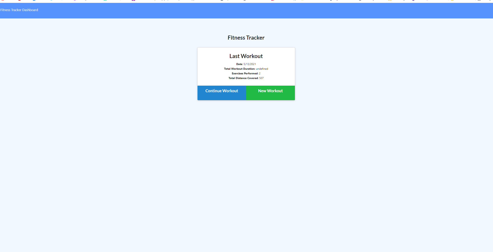
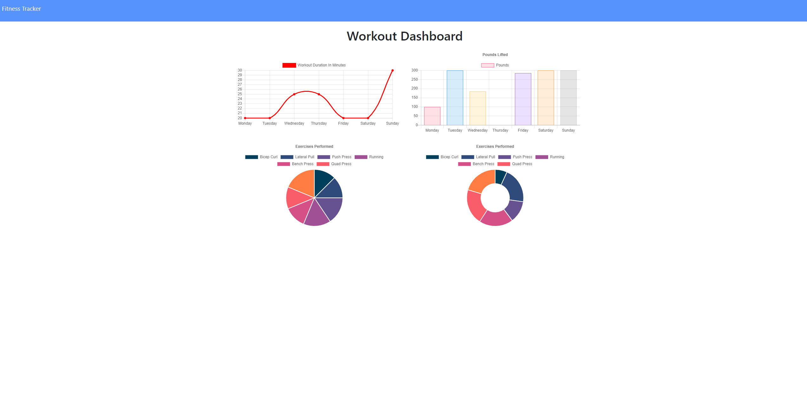

# workout-tracker

## Project Summary 
Provide the backend for a workout tracker that will allow users to add in new exercises, and see charts of their past workouts.

## Built with
-Javascript

-Mongoose

-HTML

-CSS

## Site Previews







## Code Snippets

Code used to allow user to navigate to the different HTML pages
```
const path = require('path');
const router = require("express").Router();


  router.get('/exercise', (req, res) => {
    res.sendFile(path.join(__dirname, '../public/exercise.html'));
  });

  router.get('/stats', (req, res) => {
    res.sendFile(path.join(__dirname, '../public/stats.html'));
  });

  // If no matching route is found default to home
  router.get('*', (req, res) => {
    res.sendFile(path.join(__dirname, '../public/index.html'));
  });

  module.exports = router
```


the model for workout, which required nesting objects within an overarching object
```
const WorkoutSchema = new Schema({
  day: {
    type: Date,
    default: Date.now
  },

  exercises: [
    {
      type: {
        type: String,
        required: "Must choose a type",
      },
      name: {
        type: String,
        required: "Must enter a name",
      },

      duration: {
        type: Number,
        required: "Must enter a duration",
      },

      weight: {
        type: Number,
      },

      reps: {
        type: Number,
      },

      sets: {
        type: Number,
      },
      distance: {
        type: Number,
      },
    },
  ],
});
```

## My Links

[GitHub](https://github.com/SerenaChandler)

[repo](https://github.com/SerenaChandler/workout-tracker)
